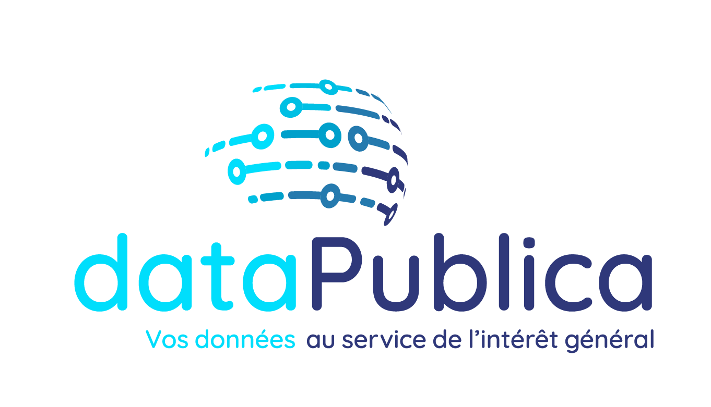
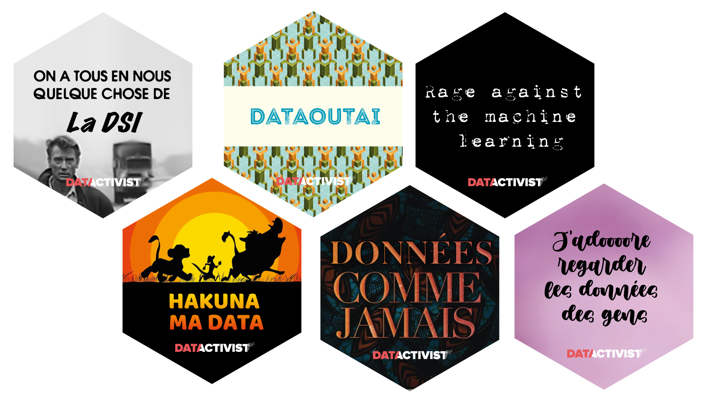
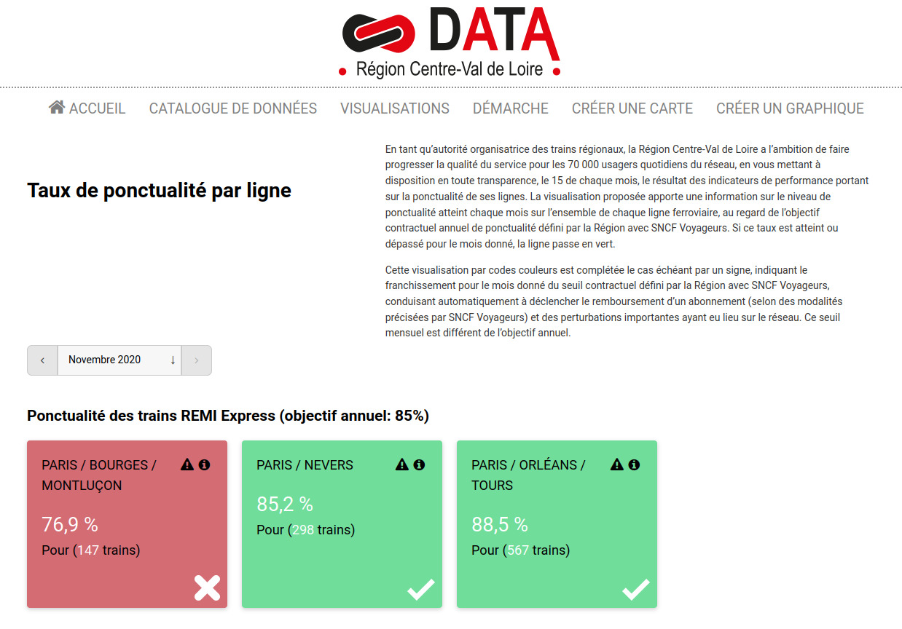
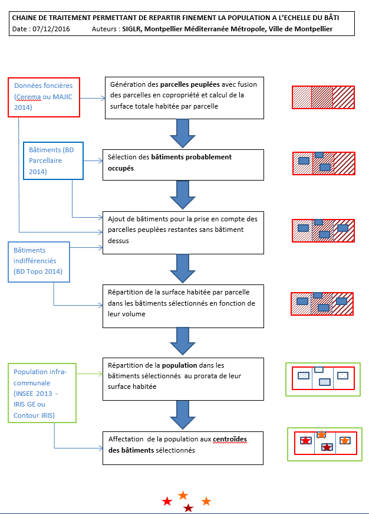
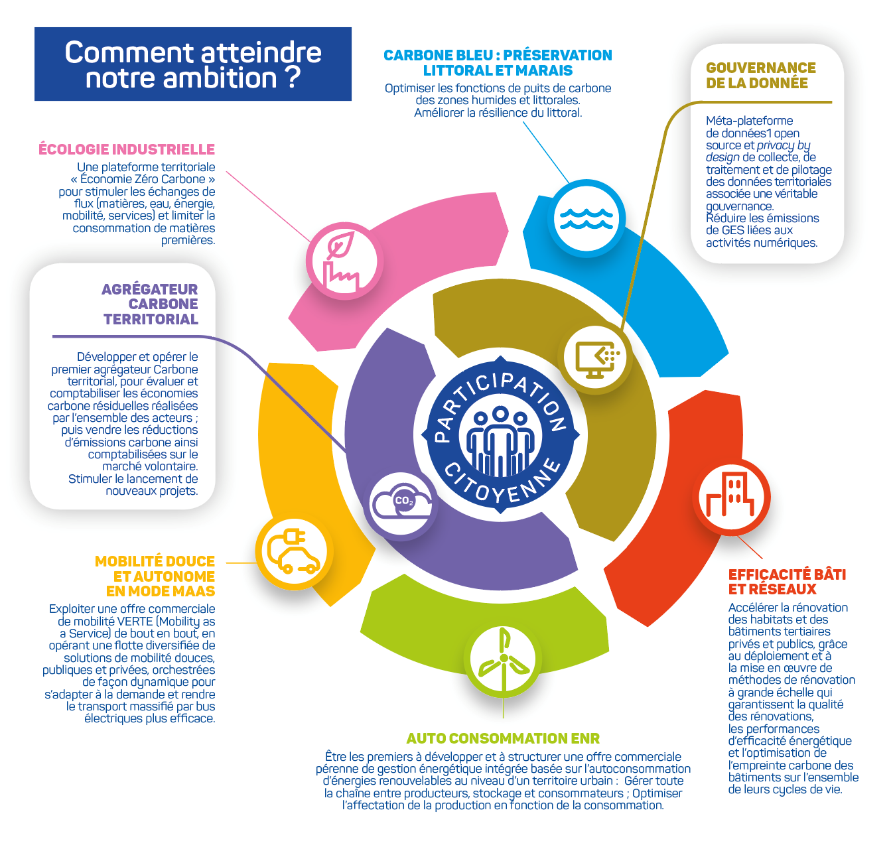
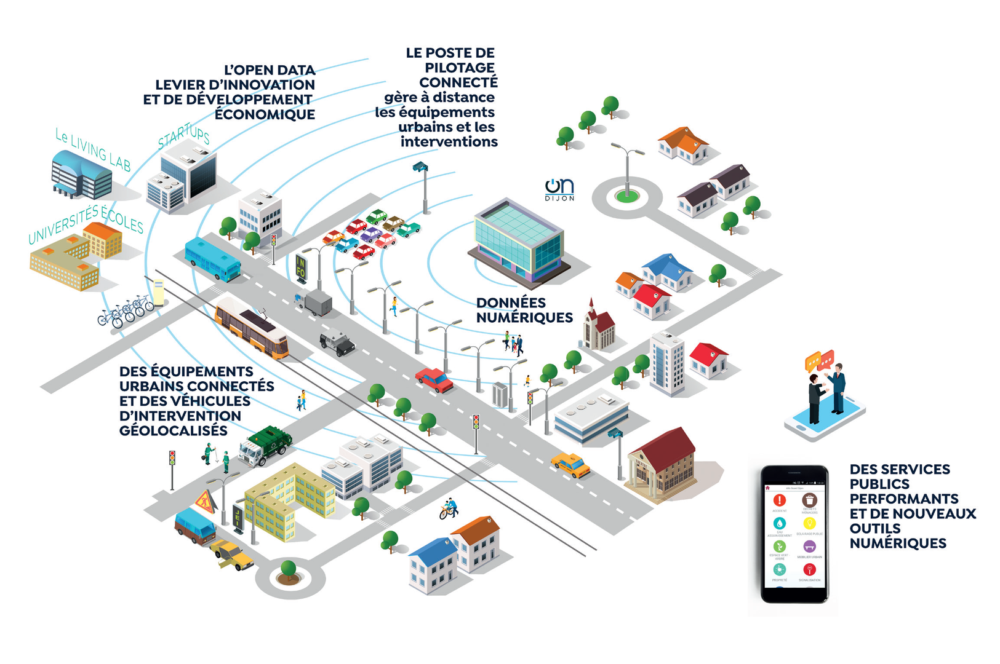
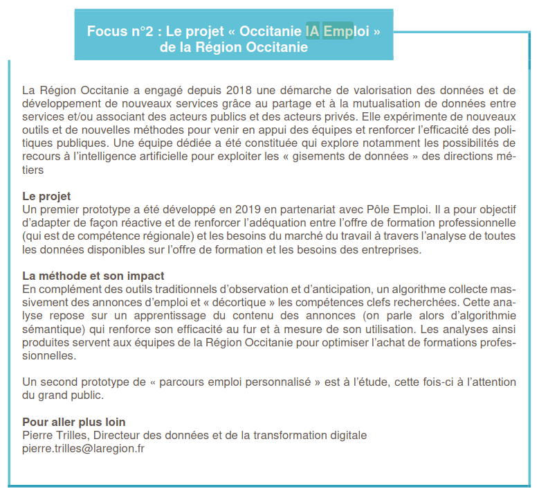
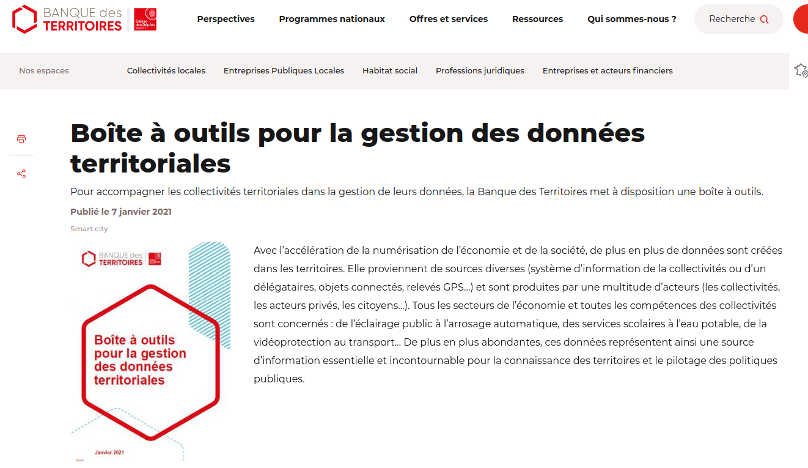

```{r, echo=FALSE}
library(metathis)
meta() %>% 
  meta_description(params$event) %>% 
  meta_name("github-repo" = paste0("datactivist/", params$slug)) %>% 
  meta_viewport() %>% 
  meta_social(
    title = params$title,
    url = paste0("https://datactivist.coop/", params$slug),
    image = params$image,
    image_alt = params$image_alt,
    og_type = "website",
    og_author = "Datactivist",
    og_locale = "fr_FR",
    og_site_name = "Datactivist",
    twitter_card_type = "summary",
    twitter_creator = "@datactivi_st")

```

layout: true

<style>
.remark-slide-number {
  position: inherit;
}

.remark-slide-number .progress-bar-container {
  position: absolute;
  bottom: 0;
  height: 4px;
  display: block;
  left: 0;
  right: 0;
}

.remark-slide-number .progress-bar {
  height: 100%;
  background-color: #e95459;
}

</style>


`r paste0("<div class='my-footer'><span>", params$event, "</span> <center><div class=logo><a href='https://datactivist.coop/'></a></div></center></span></div>")` 


---

class: center, middle

Ces slides en ligne : `r paste0("http://datactivist.coop/", params$slug)`

Sources : `r paste0("https://github.com/datactivist/", params$slug)`


Les productions de Datactivist sont librement réutilisables selon les termes de la licence [Creative Commons 4.0 BY-SA](https://creativecommons.org/licenses/by-sa/4.0/legalcode.fr).

<BR>
<BR>


---
## Qui sommes nous ?


.center[[](https://datactivist.coop)]

### We .red[open data], we make them .red[useful]

---
## Qui sommes nous ?

- Datactivist est un .red[**pure player de l’open data**] créé en 2016, par Samuel Goëta et Joël Gombin.

- Se positionnant sur .red[**toutes les étapes du travail d’ouverture des données**], Datactivist travaille tant avec les producteurs de données qu’avec les réutilisateurs et participe à l’appropriation des données par chacun.

- Nous appliquons nos propres .red[**valeurs**] : nous sommes une coopérative ; nos supports de formation et nos contenus sont librement réutilisables, publiés en licence Creative Commons.

- Une approche issue de la recherche : voir notamment **https://datactivist.coop/these**. 

- Nous animons la communauté [#TeamOpenData](https://teamopendata.org).

---
## Membre fondateur de Datapublica

.pull-left[

]
.pull-right[
Une .red[alliance] de compétences autour de la gestion des données publiques :
- Datactivist
- Civiteo
- InnoPublica
- Parme Avocats

Ainsi que l'.red[Observatoire Data Publica], une structure à but non lucratif qui analyse les usages des données par les acteurs publics. 
]


---
## Nos services

- Conseil sur les .red[**stratégies d’ouverture de données**] : nous aidons les organisations dans la conception et la mise en œuvre de leur stratégie d’ouverture de données.


- .red[**Accompagnement dans la réutilisation de données ouvertes**] : nous aidons les organisations à utiliser les données au quotidien. 

- .red[**Sensibilisation et formation à la donnée**] : nous formons à la culture générale des données, nous enseignons les grands principes et bonnes pratiques de l'open data et nous introduisons à la data science. 

- .red[**Médiation de données**] : nous organisons des hackathons, des open data camps, des expéditions de données...

---
Mais aussi... éditeur de stickers


---
class:inverse, center, middle

# Les données, c'est stratégiques !

---

<video controls>
  <source src="./img/clip.mp4" type="video/mp4">
</video>

---
### Stratégiques, les données ?

.pull-left[
.reduite[]
]

.pull-right[
- Nous vivons une véritable .red[**révolution de la donnée**], quantitative et qualitative

- de .red[**nouveaux acteurs**] transforment en profondeur la gestion des territoires (pensez à Uber, Waze, Airbnb...) en s'appuyant sur la donnée

- les .red[**besoins en données**], mais aussi les capacités d'en obtenir, sont toujours plus importants (drones, satellites, LIDAR, capteurs IoT...) 
]

---
### Quelle valeur pour les données ?


.pull-left[
- La donnée comme .red[**commodité**] : revendue par celui qui la collecte ou l’agrège.

- La donnée comme .red[**levier**] : utilisée sans marchandisation, par exemple pour réduire les coûts, développer les revenus, transformer l'organisation...

- La donnée comme .red[**actif stratégique**] : une arme pour défendre ou transformer son positionnement, sa place dans son environnement.
]

.pull-right[
.reduite[]
]

---

.pull-left[

### Pour la collectivité

- transversalité, casser les silos

- optimisation 

- innovation

- **transformation**

]

.pull-left[

### Pour le territoire

- innovation et création de valeur

- connaissance, réactivité

- résilience

- **développement durable** 
]

---
### Différents enjeux 

- .red[**Produire**] les données   

- .red[**Disposer**] des données, produites par d'autres (prestataires ou non) nécessaires au service public et à la connaissance du territoire

- .red[**Réutiliser**] des données : pilotage par la donnée, nouveaux services, IA...

- .red[**Mettre à disposition et faire circuler] des données : service public local de la donnée, data hub...

---
class: inverse, center, middle

# Quelques exemples

---

[](https://data.centrevaldeloire.fr/pages/ponctualite-ter-exintercites/)

---

[](https://data.montpellier3m.fr/dataset/distribution-fine-de-la-population)

---

[](https://www.larochelle-zerocarbone.fr/partageons-nos-donnees)

---

[](https://www.metropole-dijon.fr/Grands-projets/Les-grandes-realisations/OnDijon-metropole-intelligente-et-connectee)

---




---


---
## Pour aller plus loin...

[](https://www.banquedesterritoires.fr/gestion-des-donnees-territoriales)

---
class: inverse, center, middle

# Merci !

Contact : [joel@datactivist.coop](mailto:joel@datactivist.coop)


